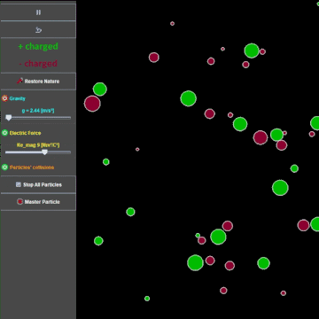
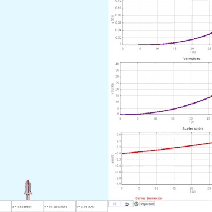

# legacy-code-memories
Code from my academic years in engineering and physics. Organization might be messy.

***Disclaimer: All content in this repository dates back significantly and should not be taken as a representation of my current expertise or adherence to best practices.***

## Some cool higlights:

### Particles in a Box (in /physics-simulations)




Custom simulation I created in EJS of a bunch of particles with toggleable elastic collisions, electric forces & gravity

### 2D Rocket Launch Simulation (in /physics-simulations)



w/ actual rocket science:

```EJS
vt = g * t + vgc * Math.log( (m0 + dm_dt * t) / m0 );
aux = 1 + dm_dt * t / m0;
yt = 0.5 * g * t*t + vgc * m0 * (aux * Math.log(aux) - aux + 1) / dm_dt;
```

### ...this thing's code is in /arduino

